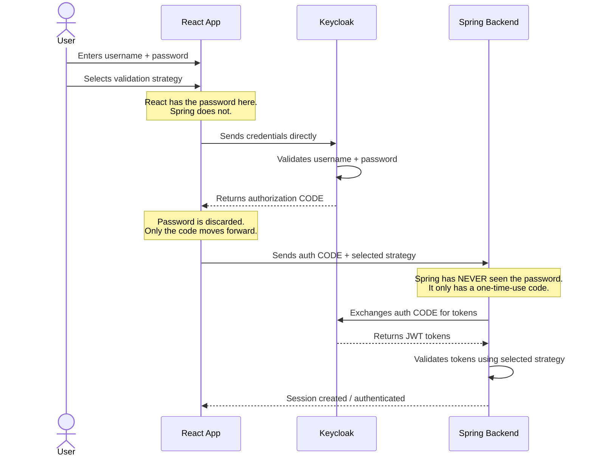

# PKCE Flow - React Login with Spring Backend

## The Core Principle

**Spring never sees the password. Ever.**

- React collects credentials and sends them directly to Keycloak
- Keycloak validates them and returns a short-lived, one-time-use **authorization code**
- React passes only that code to Spring
- Spring exchanges the code for tokens (JWT)

The authorization code is a **password proxy** — it proves the user authenticated successfully without exposing their actual credentials to your backend.

## Why This Matters

| Component | Sees Password? | Sees Auth Code? | Sees Tokens? |
|---|---|---|---|
| React | Yes (briefly) | Yes | No |
| Spring Backend | **Never** | Yes | Yes |
| Keycloak | Yes | Yes (issues it) | Yes (issues them) |

If Spring is ever compromised, attackers get tokens (which expire) but **never passwords**.

## Sequence Diagram

## Open Question

Which Keycloak endpoint does the React app hit to submit credentials and get the auth code? This is the piece to confirm with the authentication architect — it's likely the Keycloak REST authentication API or a direct POST to the authorization endpoint.
