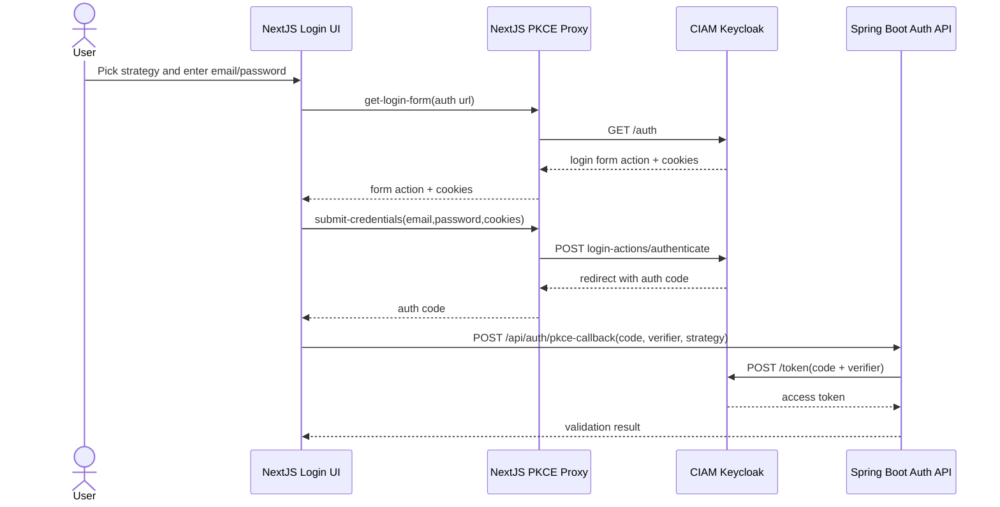
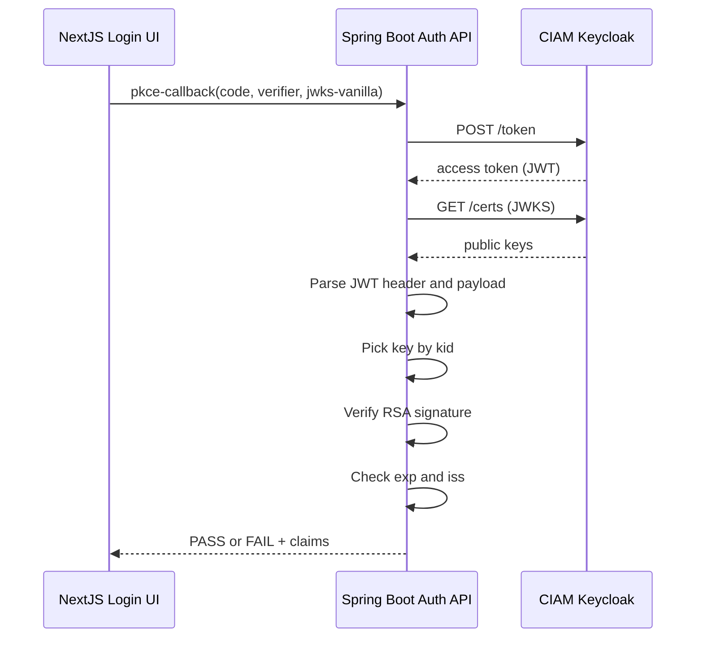
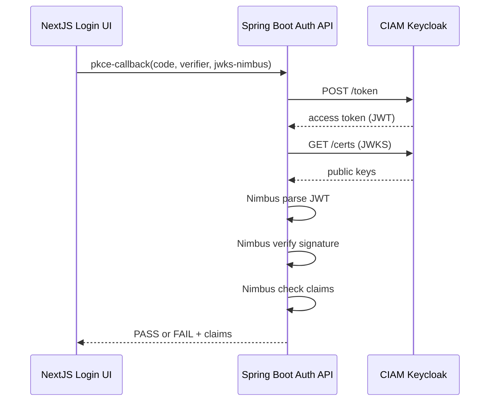
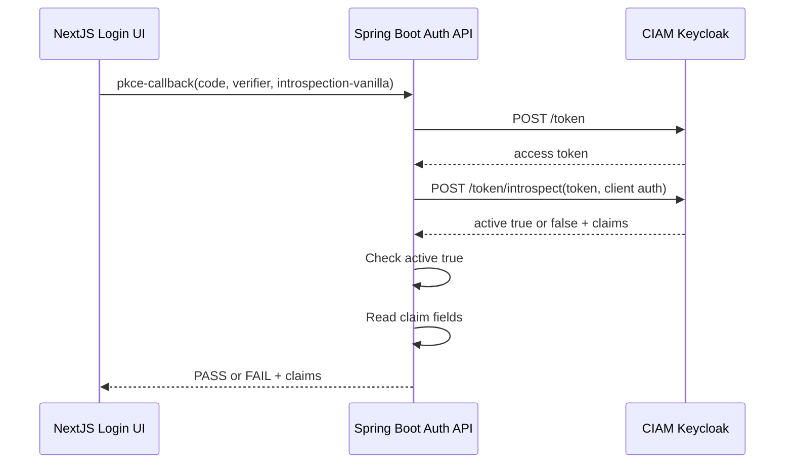
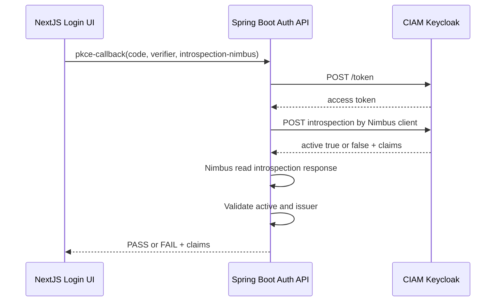

# Auth Patterns (v1.3)

5 sequence diagrams for PKCE login and Java token validation.

## 1) PKCE login: password to auth code to token

## 2) Java flow: JWKS Vanilla

## 3) Java flow: JWKS Nimbus

## 4) Java flow: Introspection Vanilla HTTP

## 5) Java flow: Introspection Nimbus

