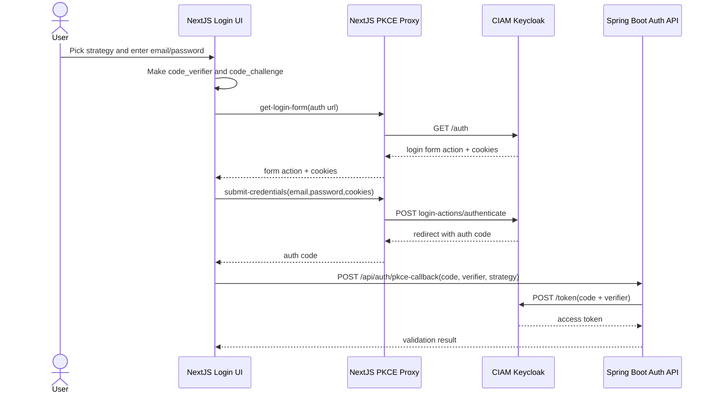
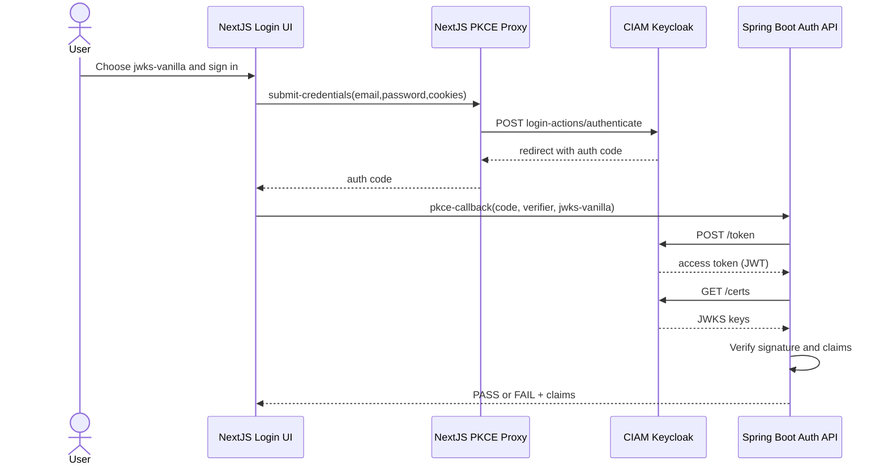
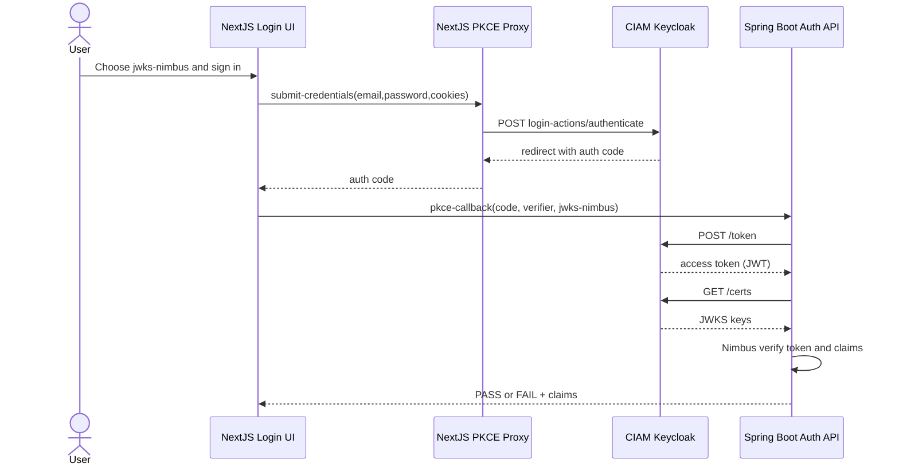
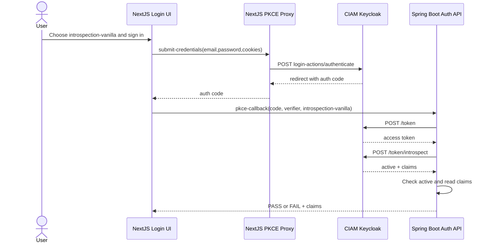
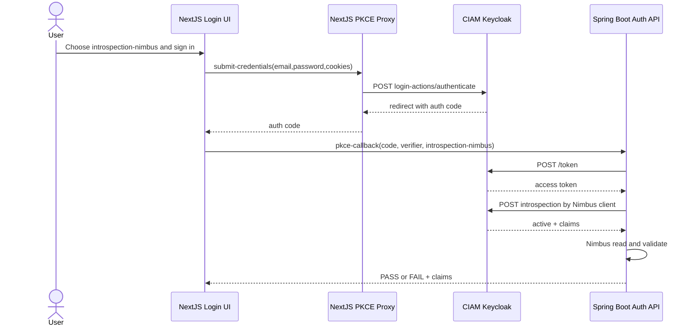

# Auth Patterns (v1.3)

Five flows for this demo. Diagram 1 gets auth code with PKCE. Diagrams 2 to 5 show the four Java validation paths.

## 1) PKCE login: password to auth code to token

| Java class | File | Lines |
|---|---|---|
| PKCE callback endpoint | `AuthController` | `claims-api/src/main/java/com/poc/claims/auth/AuthController.java:29-38` |
| Code exchange + validate dispatch | `AuthService` | `claims-api/src/main/java/com/poc/claims/auth/AuthService.java:62-108` |
| Token endpoint POST body and call | `AuthService` | `claims-api/src/main/java/com/poc/claims/auth/AuthService.java:110-150` |

## 2) PKCE + Java flow: JWKS Vanilla

| Java class | File | Lines |
|---|---|---|
| Strategy selected and invoked | `AuthService` | `claims-api/src/main/java/com/poc/claims/auth/AuthService.java:67-86` |
| JWT split, JWKS fetch, RSA verify | `JwksVanillaStrategy` | `claims-api/src/main/java/com/poc/claims/auth/strategy/JwksVanillaStrategy.java:42-119` |
| Claim extraction and result | `JwksVanillaStrategy` | `claims-api/src/main/java/com/poc/claims/auth/strategy/JwksVanillaStrategy.java:121-149` |

## 3) PKCE + Java flow: JWKS Nimbus

| Java class | File | Lines |
|---|---|---|
| Strategy selected and invoked | `AuthService` | `claims-api/src/main/java/com/poc/claims/auth/AuthService.java:67-86` |
| Nimbus JWKS source + JWT processor | `JwksNimbusStrategy` | `claims-api/src/main/java/com/poc/claims/auth/strategy/JwksNimbusStrategy.java:39-63` |
| Claim extraction and result | `JwksNimbusStrategy` | `claims-api/src/main/java/com/poc/claims/auth/strategy/JwksNimbusStrategy.java:65-100` |

## 4) PKCE + Java flow: Introspection Vanilla HTTP

| Java class | File | Lines |
|---|---|---|
| Strategy selected and invoked | `AuthService` | `claims-api/src/main/java/com/poc/claims/auth/AuthService.java:67-86` |
| Basic auth + introspection HTTP call | `IntrospectionVanillaStrategy` | `claims-api/src/main/java/com/poc/claims/auth/strategy/IntrospectionVanillaStrategy.java:42-72` |
| Active check, claim extraction, result | `IntrospectionVanillaStrategy` | `claims-api/src/main/java/com/poc/claims/auth/strategy/IntrospectionVanillaStrategy.java:88-121` |

## 5) PKCE + Java flow: Introspection Nimbus

| Java class | File | Lines |
|---|---|---|
| Strategy selected and invoked | `AuthService` | `claims-api/src/main/java/com/poc/claims/auth/AuthService.java:67-86` |
| Nimbus introspection request + parse | `IntrospectionNimbusStrategy` | `claims-api/src/main/java/com/poc/claims/auth/strategy/IntrospectionNimbusStrategy.java:42-67` |
| Active check, claim extraction, result | `IntrospectionNimbusStrategy` | `claims-api/src/main/java/com/poc/claims/auth/strategy/IntrospectionNimbusStrategy.java:68-104` |

## Key Point

Spring never sees the password. Browser and NextJS proxy send password to Keycloak. Spring gets auth code, then token.

## Quick Compare

| Mode | Keycloak call during validate | Revocation check now | Client secret |
|---|---|---|---|
| JWKS | No | No | No |
| Introspection | Yes | Yes | Yes |

| Style | Code size | Use |
|---|---|---|
| Vanilla | More | Teach protocol steps |
| Nimbus | Less | Production style |
